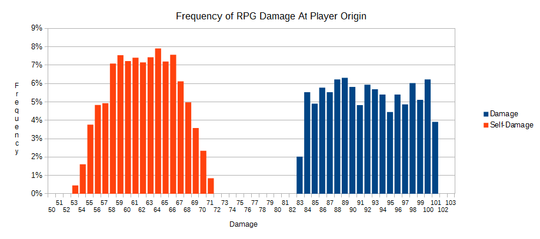

# RPG

### Damage
All damage data was measured with the rocket exploding at the player's origin exactly.

#### Damage to an enemy
* Minimum: 83
* Maximum: 101
* Average: ~92

#### Self-damage
* Minimum: 53
* Maximum: 71
* Average: ~62

#### Damage frequency

#### Radius
* Max Radius: ~109 from edge of a player's hitbox (~125 from origin of a player)
  - Radius also seems to vary based on the randomness of the damage, and seems to do about half damage at the edge of its radius

### Misc
* Projectile Speed: 900